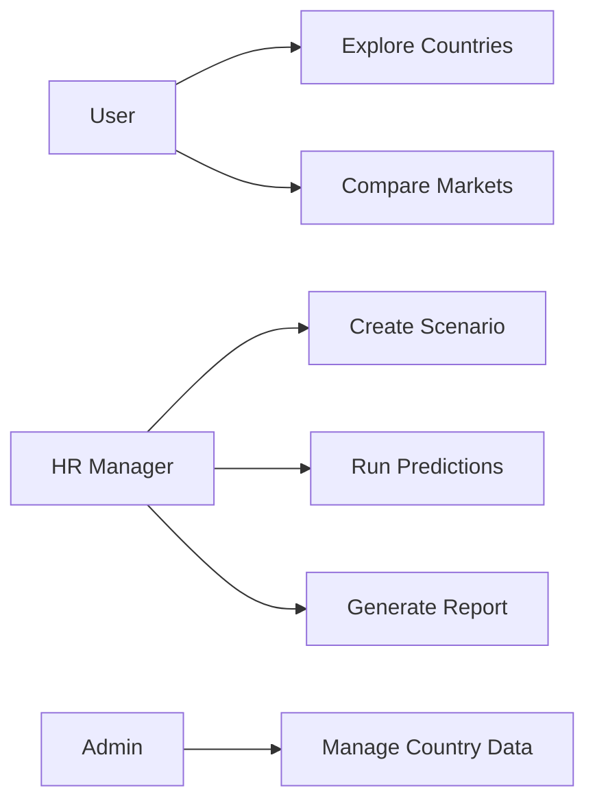
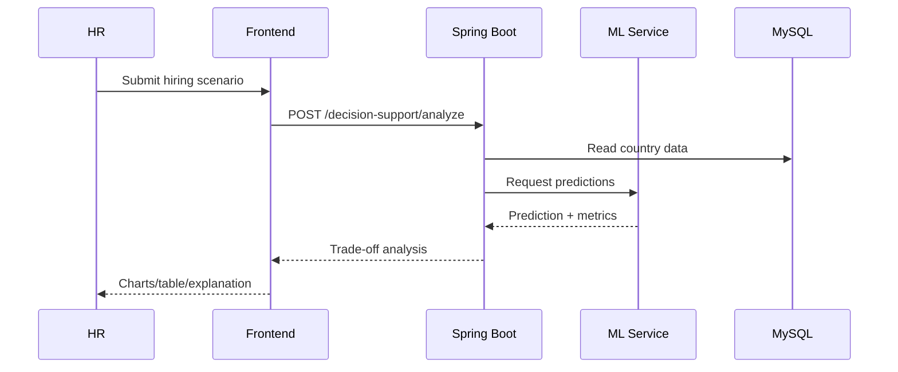

# Academic diagrams (Mermaid)
## Use case

```mermaid
flowchart LR
A[User] --> B[Explore Countries]
A --> C[Compare Markets]
HR[HR Manager] --> D[Create Scenario]
HR --> E[Run Predictions]
HR --> F[Generate Report]
AD[Admin] --> G[Manage Country Data]
```
## Sequence

```mermaid
sequenceDiagram
participant U as HR
participant F as Frontend
participant B as Spring Boot
participant M as ML Service
participant DB as MySQL
U->>F: Submit hiring scenario
F->>B: POST /decision-support/analyze
B->>DB: Read country data
B->>M: Request predictions
M-->>B: Prediction + metrics
B-->>F: Trade-off analysis
F-->>U: Charts/table/explanation
```
